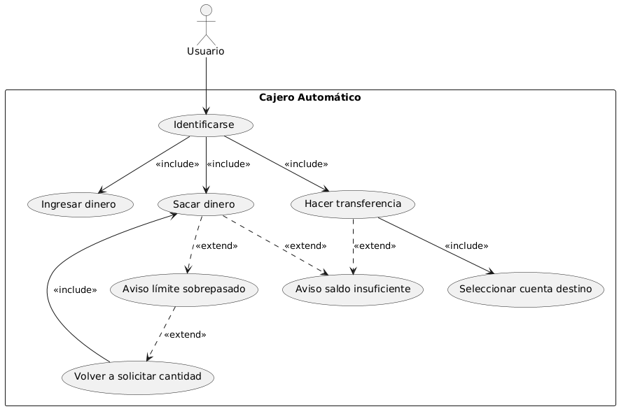

# caso_uso_1DAM_erm

# Diagrama de Casos de Uso y Descripción

## Diagrama de Uso en PlantUML

Crea el diagrama de uso haciendo uso de PlantUML, representando los actores y casos de uso que identifiques en los requisitos.

## Caso de Uso: Sacar Dinero

Describe, haciendo uso de la plantilla, al menos el caso de uso **"Sacar dinero"**, con las interacciones que tiene entre el actor y el caso de uso.

### Actores y Requisitos  
El usuario es el actor principal que interactúa con el sistema, que en este caso es un **cajero automático**.

Para poder realizar cualquier operación en el cajero, lo primero que debe hacer es **identificarse**, siendo esto obligatorio.

Al identificarse se incluyen las operaciones:

- **Ingresar dinero**
- **Sacar dinero**
- **Hacer transferencia**

Como hay que seleccionar obligatoriamente una de estas opciones, se marcan con la opción `<<include>>`.

En el caso de uso **"sacar dinero"**, el usuario puede:

1. Haberse pasado del **límite diario**.
2. No tener **saldo suficiente**.

Como estos casos pueden o no pasar, son opcionales, por lo que se marcan con una relación `<<extend>>`.

Si el usuario ha pasado el límite diario, el cajero le volverá a solicitar que ingrese una nueva cantidad de dinero.  
Este escenario **no ocurre siempre**, por lo que se usa `<<extend>>`.  

Sin embargo, si ocurre, el usuario **debe ingresar una nueva cantidad**, por lo que se enlaza con **sacar dinero** con `<<include>>`, ya que es obligatorio.

---

## ¿Para qué sirve un Diagrama de Casos de Uso?

Un diagrama de casos de uso ayuda a:

### 1. Entender lo que debe hacer el sistema  
Muestra las funcionalidades que el sistema debe ofrecer, como **qué cosas puede hacer el usuario** o **qué operaciones puede realizar el sistema**.

### 2. Ver quién va a usar el sistema  
Los **actores** representan las entidades que utilizarán el sistema.  
Sirve para visualizar **quién** y **cómo** interactuará con el sistema.

### 3. Ayuda a planificar el desarrollo  
Es una especie de **guía** para saber por dónde empezar a construir el sistema.  
Permite entender **qué componentes construir** y **qué debe hacer cada parte**.

### 4. Facilitar la comunicación entre todos  
El diagrama ayuda a que **clientes, desarrolladores y otros involucrados** entiendan claramente cómo funcionará el sistema.

### **En resumen**  
Un diagrama de casos de uso **sirve para planificar, entender el sistema y mejorar la comunicación** entre todos los involucrados en el proyecto.
